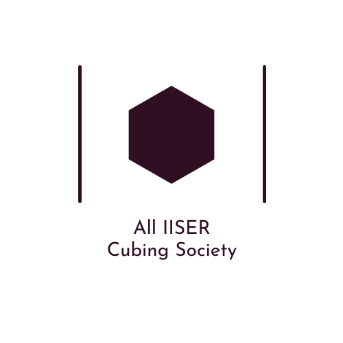
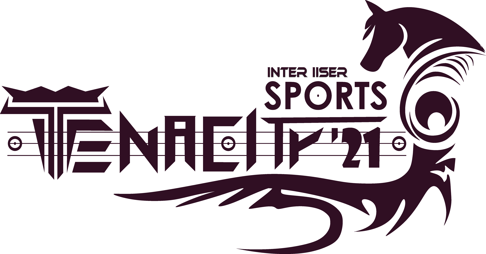

# AICS

The **All IISER Cubing Society (AICS)** is a community to bring together cubers and people interested in cubing from different science institutes in India.

We currently hold **Weekly Online Cubing Events**, on weekends.

## Weekly Online Event

To participate, be present on the WhatsApp group at the given date and time.

- **Date:** 17th April 2021, Saturday
- **Time:** 06:00 PM IST
- **Submission Deadline**: 06:40 PM IST
- **Events:** 3x3

**Make sure you read the [Rules and Guidelines](/rules).** You may also read the helpful [Video Compression Guide](/compression), which would show a simple way to compress videos recorded from your device. Compression is helpful in case your video file size is getting quite large.

The results for the past weekly events can be found on the [Results](/results) page.

---

## Tenacity Cubing Events

Tenacity is an All IISER Virtual Games and Sports Fest, born out of the collaboration between the sports secretaries and event coordinators from all 7 IISERs, NISER, IISc and CEBS.

Follow Tenacity:

- **Instagram:** [@tenacity.iisers](https://www.instagram.com/tenacity.iisers/) 
- **Facebook:** [@tenacity.iisers](https://www.facebook.com/tenacity.iisers/)
- **YouTube:** [Tenacity : All IISER Virtual Games & Sports](https://www.youtube.com/channel/UCsw80KHBncsruxA3iw9bLgg)

### Talks

Yash Mehta from IISc, inventor of the [Mehta Method](https://www.speedsolving.com/wiki/index.php/Mehta), gave a talk on Speedcubing Method Development.

- **Speaker:** Yash Mehta, IISc
- **Topic:** How to invent a speedcubing method
- **Date:** 3rd April 2021, Saturday
- **Time:** 06:00 PM IST
- **Video Link:** [https://www.youtube.com/watch?v=NNIuRIYKtEI](https://www.youtube.com/watch?v=NNIuRIYKtEI)

### Cubing Event

The Tenacity Cubing Event, sponsored by Cubelelo, was held during 2nd-4th April. The final day was streamed live.

- **Date:** 4th April 2021, Sunday
- **Time:** 11 AM - 01 PM IST
- **Play-offs:**: [https://www.youtube.com/watch?v=VFW563E0Obo](https://www.youtube.com/watch?v=VFW563E0Obo)
- **Finals:** [https://www.youtube.com/watch?v=hZc6JJ-jOLA](https://www.youtube.com/watch?v=hZc6JJ-jOLA)

The final standings:

1. IISER Kolkata
2. IISc
3. IISER Pune
