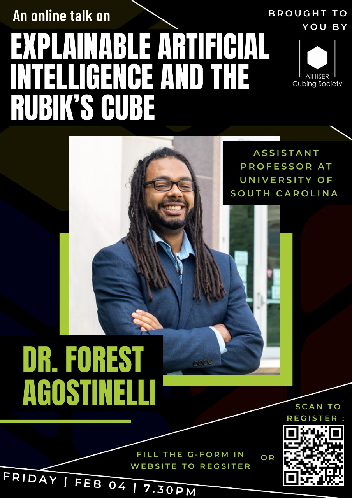
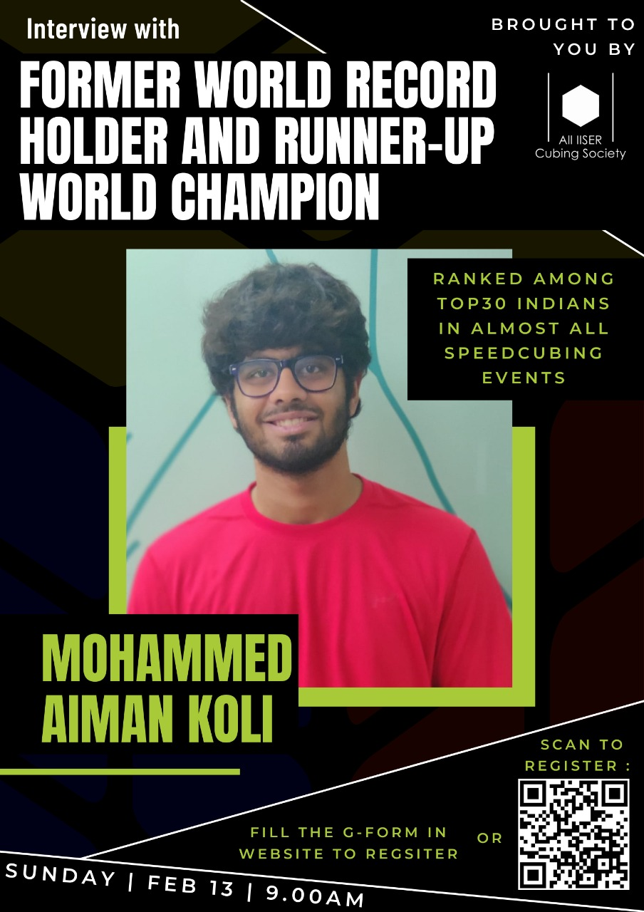

# AICS

The **All IISER Cubing Society (AICS)** is a community to bring together cubers and people interested in cubing from different science institutes in India.

We currently hold **Weekly Online Cubing Events**, on weekends.

!> Site details may not be updated as frequently as necessary due to the site maintainer ~~being lazy~~ not being always available. If you are in the WhatsApp Group, the latest updates will always be available there.

## Joining AICS

If you are a cuber or a person interested in cubing, we invite you to join AICS.
WhatsApp Group Link: https://chat.whatsapp.com/C9VNzsjt2cXGsIeY2XMYHc

## Weekly Online Event

To participate, be present on the WhatsApp group at the given date and time, or use the Form Link directly.

- **Date:** 14th April 2022, Saturday
- **Time:** 04:00 PM IST
- **Submission Deadline**: 09:00 PM IST
- **Events:**
    - 3x3
    - To Be Decided

- **Form Link:** https://forms.gle/XEXTDjZ9gGtau5hJ8

**Make sure you read the [Rules and Guidelines](/rules).** You may also read the helpful [Video Compression Guide](/compression), which would show a simple way to compress videos recorded from your device. Compression is helpful in case your video file size is getting quite large.

The results for the past weekly events can be found on the [Results](/results) page.

---

## AICS Cubing League

AICS conducted the AICS Cubing League, a tournament between the different science institutes. The final standings:

1. IISER Pune
2. IISc
3. IISER Kolkata
4. IISER Berhampur

The event instructions can be seen on the [Cubing League](/cubing-league) page. The Play-offs and Finals can be viewed on the [AICS YouTube Channel](https://youtube.com/channel/UCXOIh4FS48Dwy3BC9_FhprA).

## Talks

### Explainable AI and the Rubik's Cube - Dr. Forest Agostinelli

A talk by Dr. Forest Agostinelli (Assisant Professor at University of South Carolina) on *Explainable Artificial Intelligence and the Rubik’s Cube*. 

- **Date:** 04 February 2022, Friday
- **Time:** 07:30 - 08:30 PM IST
- **Registration:** https://docs.google.com/forms/d/e/1FAIpQLSdHFcUuSqeIJy6O1_iKL0cJCqxFgK_Cu0occuBsGMP_3qtj-g/viewform

Fill the form if you want to be present in the meet (we will take in only about a 100 participants, and only students of IISERs, IISc, NISER,CEBS).

The talk will also be livestreamed on our [YouTube Channel](https://www.youtube.com/channel/UCXOIh4FS48Dwy3BC9_FhprA).

### Interview with Aiman Koli

An interview featuring Mohammed Aiman Koli, one of India's finest speedcubers, a former World record holder and a former World champion runner-up.

- **Date:** 13 February 2022, Sunday
- **Time:** 09:00 - 10:00 AM IST
- **Registration:** https://docs.google.com/forms/d/e/1FAIpQLSfgpsBLUGk5kukJi76lTKwf-rfM_pPTgf2hYmwHDRBBA8rvqw/viewform

Fill the form if you want to be present in the meet (we will take in only about a 100 participants, and only students of IISERs, IISc, NISER,CEBS).

The talk will also be livestreamed on our [YouTube Channel](https://www.youtube.com/channel/UCXOIh4FS48Dwy3BC9_FhprA).

---

## Tenacity Cubing Events

Tenacity is an All IISER Virtual Games and Sports Fest, born out of the collaboration between the sports secretaries and event coordinators from all 7 IISERs, NISER, IISc and CEBS.

Follow Tenacity:

- **Instagram:** [@tenacity.iisers](https://www.instagram.com/tenacity.iisers/) 
- **Facebook:** [@tenacity.iisers](https://www.facebook.com/tenacity.iisers/)
- **YouTube:** [Tenacity : All IISER Virtual Games & Sports](https://www.youtube.com/channel/UCsw80KHBncsruxA3iw9bLgg)

### Speedcubing Method Development - Yash Mehta

Yash Mehta from IISc, inventor of the [Mehta Method](https://www.speedsolving.com/wiki/index.php/Mehta), gave a talk on Speedcubing Method Development.

- **Speaker:** Yash Mehta, IISc
- **Topic:** How to invent a speedcubing method
- **Date:** 3rd April 2021, Saturday
- **Time:** 06:00 PM IST
- **Video Link:** [https://www.youtube.com/watch?v=NNIuRIYKtEI](https://www.youtube.com/watch?v=NNIuRIYKtEI)

### Cubing Event

The Tenacity Cubing Event, sponsored by Cubelelo, was held during 2nd-4th April. The final day was streamed live.

- **Date:** 4th April 2021, Sunday
- **Time:** 11 AM - 01 PM IST
- **Play-offs:** [https://www.youtube.com/watch?v=VFW563E0Obo](https://www.youtube.com/watch?v=VFW563E0Obo)
- **Finals:** [https://www.youtube.com/watch?v=hZc6JJ-jOLA](https://www.youtube.com/watch?v=hZc6JJ-jOLA)

The final standings:

1. IISER Kolkata
2. IISc
3. IISER Pune
