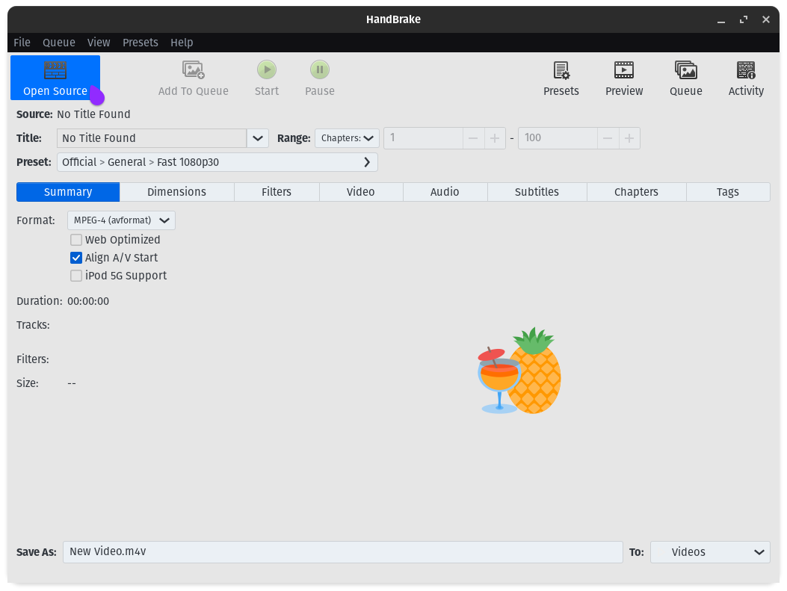
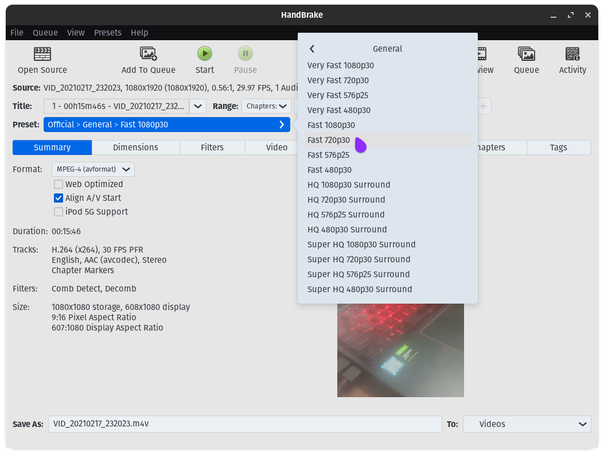
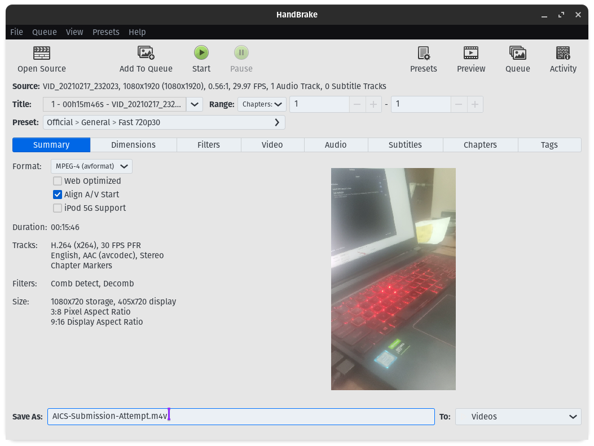
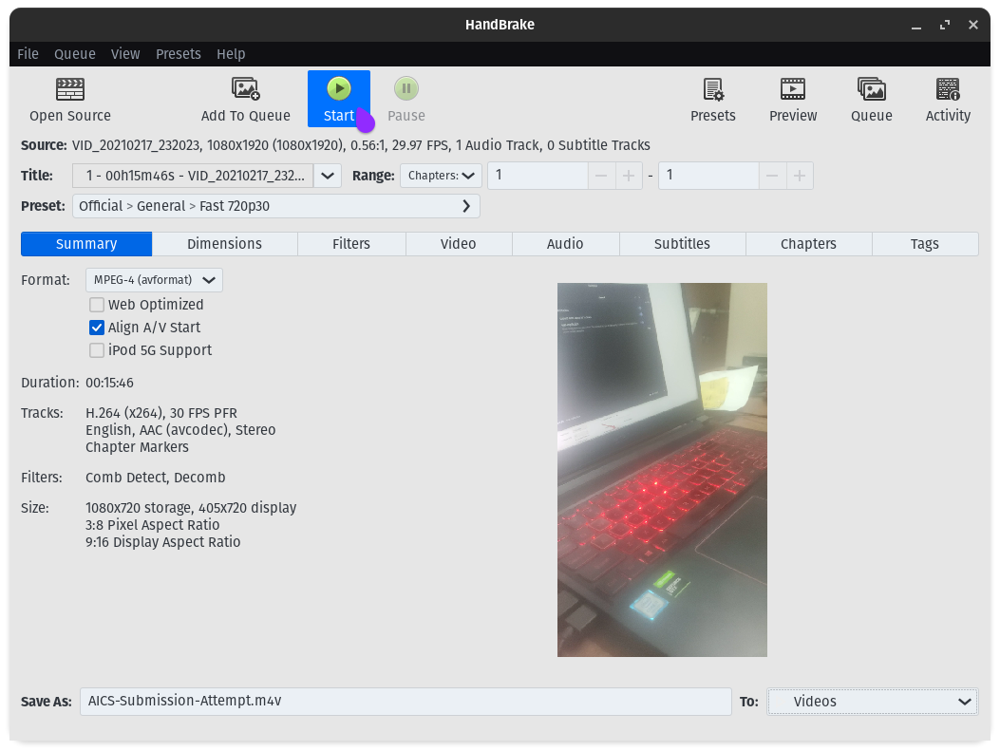
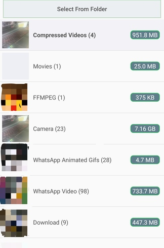
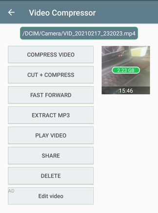
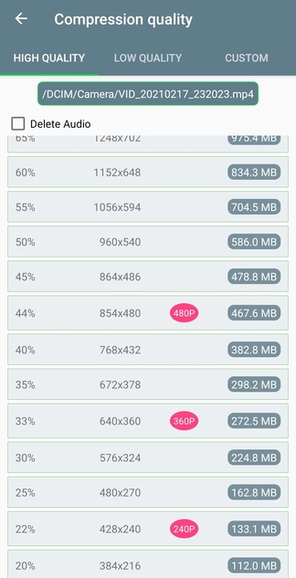

# Guide to Compressing Videos 

By Purva, IISER Pune

## Desktop - Windows / Linux / Mac

We would cover two methods:

1. HandBrake
2. FFMPEG

---

### HandBrake

Website: https://handbrake.fr/


HandBrake is an open-source video transcoding software. It is available on all the three major platforms: Linux, Windows, Mac. Simply download it.

Let's do a simple run through of what we would do:


1. Click on **Open Source**, and select the video.

   


2. Once the video is loaded, click on **Preset**, select `General` and then `Fast 720p30`. 

   


3. Set the Destination filename and directory in the **Save As** and **To** options at the bottom.

   


4. Click on **Start** and wait till it finishes. It may take 5-10 minutes, depending upon the computer hardware and the video length and size.

   


Once the process finishes, the final video will be saved at the location mentioned.


The video will likely have its size reduced with almost no loss in visual quality.


In case these simple steps do not work for you, you can mess around with more options, like bitrate, framerate and all, using this [Video Compression Guide for HandBrake](https://engagemedia.org/help/video-compression-step-by-step-handbrake-tutorial/). Note that these involve more tweaking of parameters, and prefer using this guide only if the above simple steps do not work for you.


### FFMPEG

FFMPEG is a powerful tool, and is recommended to use only if you are familiar and somewhat comfortable with the command line, and if you understand what the following installation steps mean. Otherwise, it is very much recommended to stick to HandBrake. [HandBrake actually uses FFMPEG at the core.]


#### Installation

##### Windows

You are highly recommended to stick to HandBrake. Proceed only if you know what you are doing and what the terms here mean.

Download the Git Full binary for Windows.

Direct Download Link: https://www.gyan.dev/ffmpeg/builds/ffmpeg-git-full.7z


Extract it using 7-Zip (if you don't have it, here's the [7-Zip Site](https://www.7-zip.org/)). Inside the `bin/` folder you'll find the following three binaries:  `ffmpeg.exe`, `ffplay.exe` and `ffprobe.exe`. Put them in some folder, wherever you wish, and add that folder to`PATH`.

Now, open your preferred Terminal [PowerShell or Windows Terminal or whatever you use], and check if `ffmpeg` works and gives an output.


##### Linux

```bash
sudo apt install ffmpeg
```


##### Mac

```bash
brew install ffmpeg
```


#### Usage

The simplest way to do it is follows:

`ffmpeg -i inputfilename.mp4 -preset slow outputfilename.mp4`


It may or may not work well for you. If it doesn't, you'll have to mess around with bitrates and other stuff. Find some online guide by searching for how to compress videos with FFMPEG. These commands typically are something like:


```sh
ffmpeg -i input.mp4 -preset slow -b:v 1M output.mp4
```


---

## Smartphones

If possible, you are very much advised to first transfer the video to a desktop computer or a laptop, and then use the above guide. This is because computers have a higher processing power, and can do video processing much faster than a phone.

In case you really have no option but to use your phone, then here's some things that can be done.


### Android

This [Video Compressor](https://play.google.com/store/apps/details?id=com.idea.videocompress) application, by MobileIdea Studio, works decent. Download and open it.

1. Find the video that you recorded. It may be under the *Camera* option. 

   

2. Select the first option, **Compress Video.**

   

3. Select a resolution, depending on the size you may be comfortable with. Don't go too low, or else the video may look quite bad. About `360p` or `480p` or something between them should be fine.

   


Wait for the compression to complete. It may take a while. After it is done, the processed video is saved under the `IdeaVideoCompressor` album.


###  iOS

I do not own an iPhone to test video compressing applications, but the following seem of interest, and you are advised to test them. You are very much welcome to give feedback on how they went and can help contribute to this section.


- [Video Compress - Shrink Vids](https://apps.apple.com/us/app/video-compress-shrink-vids/id997699744)
- [Video Compressor - Reduce Size](https://apps.apple.com/us/app/video-compressor-reduce-size/id1135183644)
- [Video compressor - save space](https://apps.apple.com/us/app/video-compressor-save-space/id1422359394)

